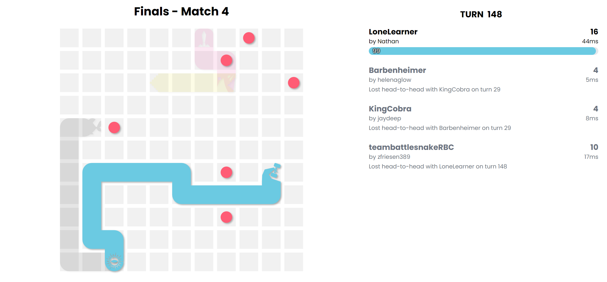

# Lindor :candy::sparkles:

> *Lindor, sweet serpent,*
>
> *Furry, cute, yet not for feasts,*
>
> *Tempting, but untouched.*

## About

[Lindor](https://play.battlesnake.com/profile/wocrekcatta) (originally LoneLearner) is a machine learning snake that won **1st place** :trophy: in the **RBC Summer 2023 Battlesnake tournament**. The snake is trained using reinforcement learning in conjunction with a *supervisor* that error checks moves in deployment.

After winning the tournament Lindor was released to the [global arena](https://play.battlesnake.com/leaderboards) it quickly climbed the ranks in standard and duels reaching a global rank of 14th in standard.

## Testing and Development

## What's included?
- API (Written in Golang with the Fiber framework)
- Python RL w/API (PPO-clip inference server using FastAPI)
- Python RL Notebooks (for model training and visualization)
- Treesearch (Mini-max C++ treesearch with heuristics)
- Treesearch Sidecar

## How it works

### How it was trained

### Name Origin

;))

### Inspiration

## Future Improvements
- consider migrating frameworks!
- upgrading treesearch algo (multi-threading)

## Benchmark and Playing Strength

## Other Repos

**Benchmark** - **[Nathan13888/bs-benchmark](https://github.com/Nathan13888/bs-benchmark)**

<!-- TODO -->
<!--**Dashboard** -  -->

